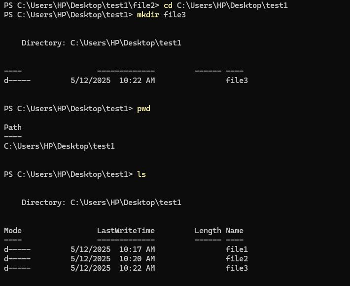

# Introduction:

### Hi! I'm Jawhara, a Civil Engineering graduate and a beginner in web development. I'm currently learning JavaScript at LTUC, exploring the world of coding and building my skills step by step. I'm excited to grow in tech and apply my problem-solving mindset in new ways.

## What I learned from The Good Delveper Mindset article?

### This article taught me that being a great developer is not just about coding skills but also about having the right mindset. I learned the importance of lifelong learning, breaking problems into smaller pieces, and debugging like a detective. It also highlighted the value of a growth mindset, focusing on user value, writing simple and maintainable code, and being open to feedback and collaboration. Most importantly, it reminded me that progress matters more than perfection, and that the mindset I bring to development will shape my long-term success.

## What I learned from Terminal Command Cheat Sheet article?

### From this article, I learned the basic terminal commands that help navigate and manage the filesystem. Commands like pwd show my current directory, ls lists contents, cd changes directories, and mkdir or touch let me create folders and files. I also learned how the filesystem is structured like a tree and how helper commands like clear, tab, and the arrow keys improve efficiency when using the terminal.

## A screenshot for the used terminal command

